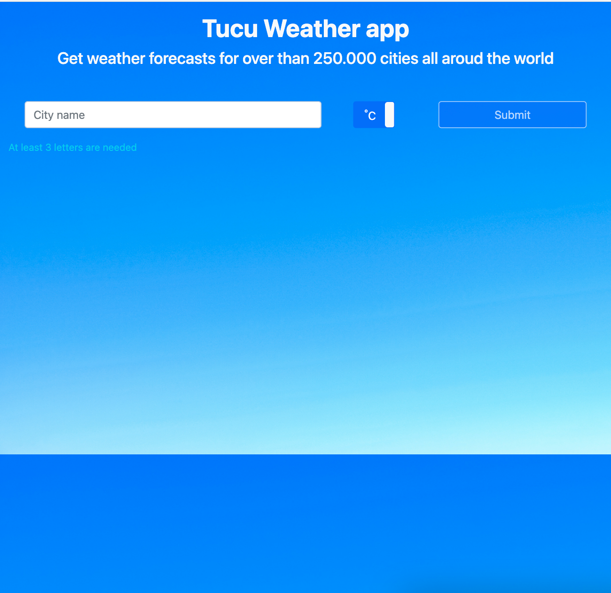
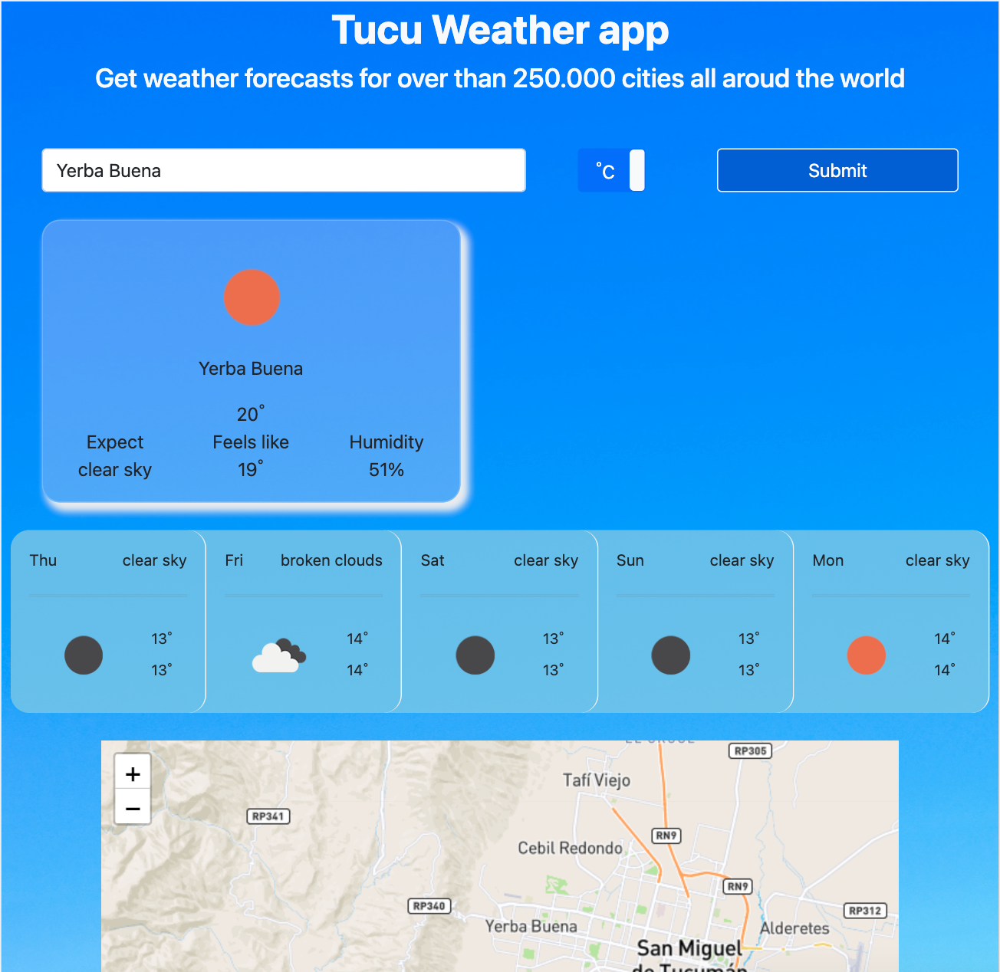
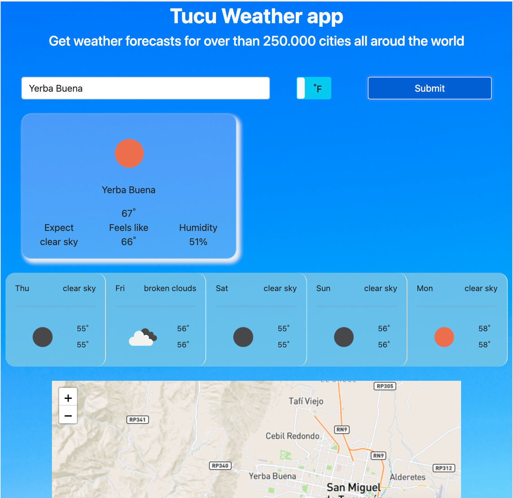

## Project: TucuWeather App

## Features

- Lets users ask for the forecast of their favourite city
- Gets updated forecasts for more than 250.00 cities

## Built With

- HTML5
- CSS3
- Javascript (ES6)

## Live Demo

Visit [TucuWeather App](https://zealous-bell-630b4e.netlify.app/)

## Prerequisites

- Internet browser compatible with HTML5, CSS3 and Javascript ES6

## Getting Started

- Open your terminal - Windows: `Win + R`, then type `cmd` | Mac: `Command + space`, then type `Terminal`
- Navigate to a directory of your choosing using the `cd` command
- Run this command in your OS terminal: `git clone https://github.com/MiguelArgentina/todo-list.git` to get a copy of the project.
- Navigate to the project's directory using the `cd` command

### Usage

From within the project directory open the `index.html`

## Authors

👤 &nbsp; **Diego Hernández**

- GitHub: [@Diegodsha](https://github.com/Diegodsha)
- Twitter: [@diegohdezchimo](https://twitter.com/diegohdezchimo)
- Portfolio: [Portfolio](https://dshagui.com/)

👤 &nbsp; **Miguel Ricardo Gomez**

- GitHub: [@MiguelArgentina](https://github.com/MiguelArgentina)
- Twitter: [@Qete_arg](https://twitter.com/Qete_arg)
- LinkedIn: [Miguel Ricardo Gomez](https://www.linkedin.com/in/miguelricardogomez/)

 
 

  
   
   

## Show your support

Give a ⭐️ if you like this project!

## Acknowledgments

This project was based on [The Odin Project](https://www.theodinproject.com/paths/full-stack-javascript/courses/javascript/lessons/todo-list) lesson
